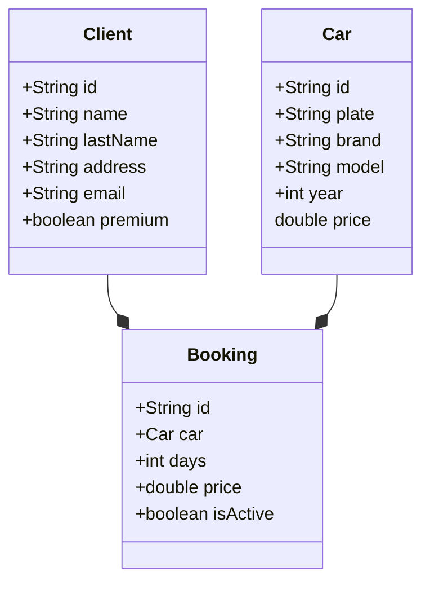

# rentingCarv1

---

## UML Data Model

---

### Class Car

```java
public class Car
{
    private String id;
    private String plate;
    private String brand;
    private String model;
    private int year;
    private double price;

    //Constructor, getters & setters, methods and toString
}
```

### Class Client

```java
public class Client
{
    private String id;
    private String name;
    private String lastName;
    private String address;
    private String email;
    private boolean premium;

    //Constructor, getters & setters and toString
}
```

### Class Booking

```java
public class Booking
{
    private String id;
    private Car car;
    private int days;
    private double price;
    private boolean isActive;

    //Constructor, getters & setters and toString
}
```

---

## UML

---



## Tech Stack

---

- IDE: IntelliJ IDEA 2025.2.1 (Community Edition)

- Java 21

- Maven Project: maven-archetype-quickstart


## POM.XML

---

```java
<project xmlns="http://maven.apache.org/POM/4.0.0" xmlns:xsi="http://www.w3.org/2001/XMLSchema-instance"
  xsi:schemaLocation="http://maven.apache.org/POM/4.0.0 http://maven.apache.org/xsd/maven-4.0.0.xsd">
  <modelVersion>4.0.0</modelVersion>

  <groupId>org.example</groupId>
  <artifactId>rentingCarTest</artifactId>
  <version>1.0-SNAPSHOT</version>
  <packaging>jar</packaging>

  <name>rentingCarTest</name>
  <url>http://maven.apache.org</url>

  <properties>
    <project.build.sourceEncoding>UTF-8</project.build.sourceEncoding>
  </properties>

  <dependencies>
    <dependency>
      <groupId>junit</groupId>
      <artifactId>junit</artifactId>
      <version>3.8.1</version>
      <scope>test</scope>
    </dependency>

      <dependency>
          <groupId>com.github.javafaker</groupId>
          <artifactId>javafaker</artifactId>
          <version>1.0.2</version>
      </dependency>
  </dependencies>
</project>

```
