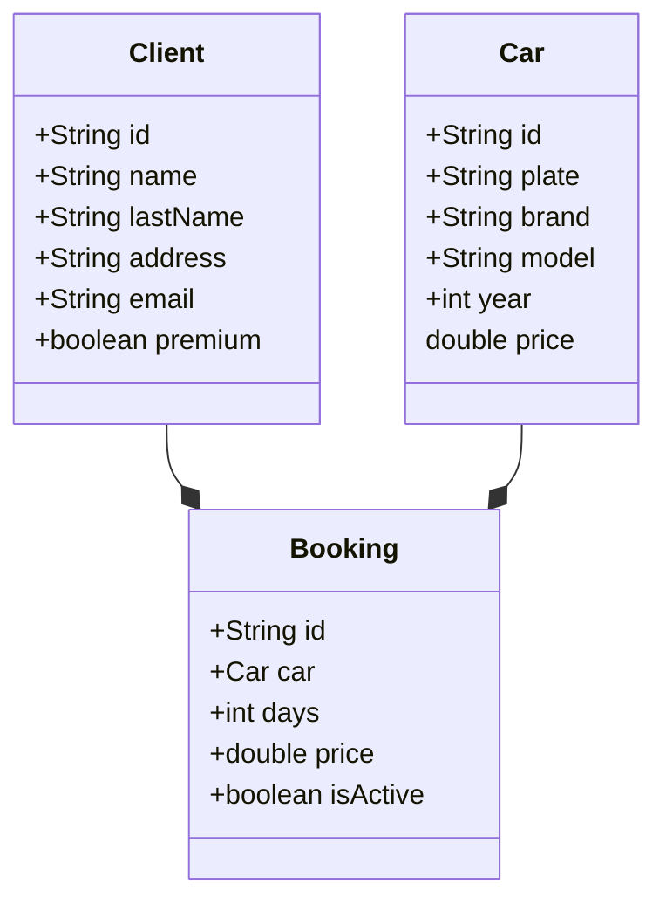

# rentingCarv1

---

## UML Data Model

---

### Class Car

```java
public class Car
{
    private String id;
    private String plate;
    private String brand;
    private String model;
    private int year;
    private double price;

    //Constructor, getters & setters, methods and toString
}
```

### Class Client

```java
public class Client
{
    private String id;
    private String name;
    private String lastName;
    private String address;
    private String email;
    private boolean premium;

    //Constructor, getters & setters and toString
}
```

### Class Booking

```java
public class Booking
{
    private String id;
    private Car car;
    private int days;
    private double price;
    private boolean isActive;

    //Constructor, getters & setters and toString
}
```

---

## UML

---



## Tech Stack

---

- IDE: IntelliJ IDEA 2025.2.1 (Community Edition)

- Java 21

- Maven Project: maven-archetype-quickstart
